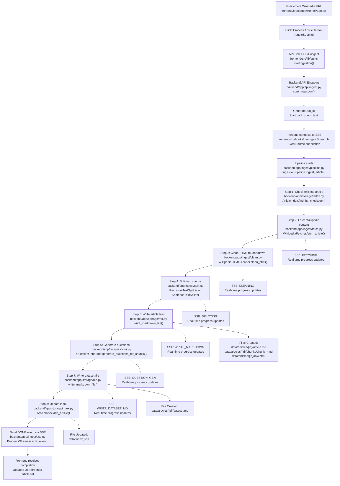

# Article Processing Workflow

This document explains the complete workflow when a user provides an article link and clicks "Process Article" in the RAG Dataset Creator application.

## Workflow Diagram



## Detailed Step-by-Step Flow

### 1. Frontend Initiation 
- **File**: `frontend/src/pages/HomePage.tsx`
- **Action**: User clicks "Process Article" button which triggers `handleSubmit()`
- **Data**: Sends URL + processing options (chunk size, overlap, strategy, total questions, etc.)

### 2. API Call
- **File**: `frontend/src/lib/api.ts`  
- **Action**: `startIngestion()` makes POST request to `/ingest` endpoint
- **Data**: Sends `IngestRequest` with Wikipedia URL and options

### 3. Backend API Handler
- **File**: `backend/app/api/ingest.py`
- **Action**: `start_ingestion()` generates unique `run_id` and starts background task
- **Return**: Immediate response with `run_id` and "started" status

### 4. Real-time Connection 
- **File**: `frontend/src/hooks/useIngestStream.ts`
- **Action**: Frontend establishes EventSource connection to `/ingest/stream/{run_id}`
- **Purpose**: Receives real-time progress updates via Server-Sent Events (SSE)

### 5. Pipeline Processing (Background Task)
The main ingestion pipeline in `backend/app/ingest/pipeline.py` runs these steps:

#### Step 1: Check Existing Article
- **File**: `backend/app/storage/index.py`
- **Action**: `ArticleIndex.find_by_checksum()` checks if article already exists
- **SSE**: Sends progress updates to frontend

#### Step 2: Fetch Wikipedia Content
- **File**: `backend/app/ingest/fetch.py`
- **Action**: `WikipediaFetcher.fetch_article()` downloads raw HTML
- **SSE**: "FETCHING" stage updates
- **Output**: Raw HTML content + metadata (title, language, URL)

#### Step 3: Clean & Convert to Markdown
- **File**: `backend/app/ingest/clean.py`
- **Action**: `WikipediaHTMLCleaner.clean_html()` processes HTML
- **Tasks**: 
  - Remove unwanted elements (navboxes, citations, etc.)
  - Convert to structured Markdown
  - Extract sections and heading hierarchy
- **SSE**: "CLEANING" stage updates
- **Output**: Clean Markdown content + section metadata

#### Step 4: Split into Chunks
- **File**: `backend/app/ingest/split.py`
- **Action**: `RecursiveTextSplitter` or `SentenceTextSplitter` based on user choice
- **Tasks**:
  - Split content respecting natural boundaries
  - Handle overlaps between chunks
  - Maintain section context for each chunk
- **SSE**: "SPLITTING" stage updates
- **Output**: List of `ChunkInfo` objects with IDs, content, and metadata

#### Step 5: Write Article Files
- **File**: `backend/app/storage/md.py`
- **Action**: `write_markdown_file()` creates multiple files
- **Files Created**:
  - `data/articles/{article_id}/article.md` - Full article with frontmatter
  - `data/articles/{article_id}/chunks/chunk_*.md` - Individual chunk files
  - `data/articles/{article_id}/raw.html` - Original HTML for debugging
- **SSE**: "WRITE_MARKDOWN" stage updates

#### Step 6: Generate Questions
- **File**: `backend/app/llm/questions.py`
- **Action**: `QuestionGenerator.generate_questions_for_chunks()`
- **Tasks**:
  - Groups chunks strategically (single-chunk and multi-chunk groups)
  - Generates mix of single-chunk and multi-chunk questions
  - Calls OpenAI API for each chunk group
  - Uses prompts from `backend/app/llm/prompts.py`
  - Creates questions that span 1 or multiple chunks
- **SSE**: "QUESTION_GEN" stage updates
- **Output**: List of questions with related chunk IDs (single or multiple)

#### Step 7: Write Dataset File
- **File**: `backend/app/storage/md.py`
- **Action**: Creates final dataset in Markdown format
- **File Created**: `data/articles/{article_id}/dataset.md`
- **Content**: All questions with their associated chunks
- **SSE**: "WRITE_DATASET_MD" stage updates

#### Step 8: Update Index
- **File**: `backend/app/storage/index.py`
- **Action**: `ArticleIndex.add_article()` updates master index
- **File Updated**: `data/index.json`
- **Purpose**: Tracks all processed articles with metadata

### 6. Completion & UI Updates
- **SSE**: Final "DONE" event sent via `backend/app/ingest/sse.py`
- **Frontend**: `useIngestStream` hook receives completion
- **UI Updates**: 
  - Article list refreshes
  - Success toast notification
  - URL input clears
  - Processing state resets

## Key Supporting Files

### File Management
- `backend/app/storage/paths.py` - Defines all file paths and directory structure
- `backend/app/storage/atomic.py` - Handles atomic file writes to prevent corruption

### Utilities
- `backend/app/utils/ids.py` - Generates unique IDs for articles and chunks
- `backend/app/utils/text.py` - Text processing utilities (token counting, previews)
- `backend/app/core/errors.py` - Custom error types for different stages

### Configuration
- `backend/app/core/config.py` - Application settings and environment variables
- `backend/app/schemas/ingest.py` - Data models for requests/responses

### LLM Integration
- `backend/app/llm/openai_chat.py` - OpenAI API client
- `backend/app/llm/prompts.py` - Prompt templates for question generation

## File Structure Created

When processing is complete, the following file structure is created:

```
data/
├── index.json                           # Master index of all articles
└── articles/
    └── {article_id}/
        ├── article.md                   # Full article with metadata
        ├── dataset.md                   # Q&A dataset
        ├── raw.html                     # Original HTML for debugging
        └── chunks/
            ├── chunk_0001.md           # Individual chunk files
            ├── chunk_0002.md
            └── ...
```

## Real-time Progress Updates

The system provides real-time feedback through Server-Sent Events (SSE) with the following stages:

1. **FETCHING** - Downloading Wikipedia content
2. **CLEANING** - Converting HTML to Markdown
3. **SPLITTING** - Breaking content into chunks
4. **WRITE_MARKDOWN** - Writing article and chunk files
5. **QUESTION_GEN** - Generating questions with LLM
6. **WRITE_DATASET_MD** - Creating final dataset file
7. **DONE** - Process completed successfully
8. **FAILED** - Process encountered an error

This entire workflow creates a complete RAG dataset from a Wikipedia article, with real-time progress updates and structured file outputs that can be used for question-answering systems. 